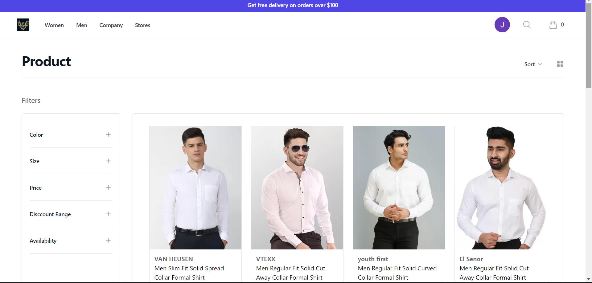

# Ecommerce_Application

A full-featured Ecommerce Application for buying and selling products online, with secure user authentication, product catalog, shopping cart, payment integration.

# Tech Stack Used

1. **Frontend:**
    - Framework: React
    - UI Libraries: Tailwind CSS, Material-UI (MUI)
    - State Management: Redux
    - Authentication: JWT (JSON Web Tokens)
    - React Router Dom
      
2. **Backend:**
    - Framework: Spring Boot
    - Security: Spring Security
    - Database: MySQL

3. **Payment Gatway:**
    - Razorpay payment Gatway
